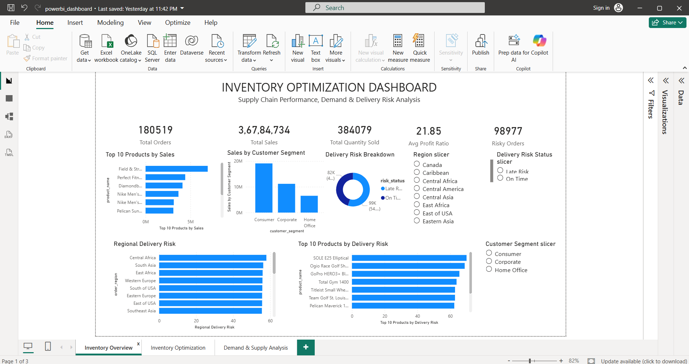

# Inventory Optimization Dashboard
## Business Problem
Most retail analytics answers "what sold." This project answers the harder question: which products are at risk of stockout or overstock, and specifically how many units should trigger a reorder for each one.
Using approximately 180K order records, the goal was to move beyond descriptive reporting into actionable inventory planning by creating a prioritized list of products with calculated reorder points.
## Tools Used
- **SQL (MySQL)** — data loading, cleaning, ABC classification via window functions, monthly demand aggregation
- **Python (pandas)** — demand variability calculations, delivery risk analysis, inventory priority scoring
- **Excel** — safety stock and reorder point formulas, conditional formatting, pivot summary
- **Power BI** — 3-page interactive dashboard with DAX measures and data modeling
## Analysis Performed
Data cleaning — loaded ~180K order line items, checked for duplicates and nulls, calculated shipping delay (actual vs. scheduled shipping days).
ABC classification — ranked all 118 products by cumulative revenue share using a SQL window function, splitting them into Class A (top 80% of revenue), B (next 15%), and C (remaining 5%).
Demand variability — calculated average monthly demand, standard deviation, and coefficient of variation per product to identify which products have unpredictable (vs. steady) demand patterns.
Delivery risk analysis — measured late delivery risk by product, region, and customer segment.
Inventory priority scoring — combined ABC class, demand variability, and delivery risk into a single priority tier (High/Medium/Low) per product.
Reorder point calculation — in Excel, calculated Safety Stock (using a 95% service level, Z=1.65) and Reorder Point per product, based on a 14-day lead time assumption (stated explicitly since the raw dataset doesn't include real supplier lead times).
Dashboard build — modeled the data in Power BI across three pages: Inventory Overview, Inventory Optimization, and Demand & Supply Analysis.
## Inventory Optimization Method

### Lead Time

A lead time of **14 days** was assumed because the dataset does not contain actual supplier lead-time information.

> Lead time assumed at 14 days based on average real-world supplier cycles, since the dataset doesn't include actual lead time data.

### Safety Stock

Safety Stock was calculated using a **95% service-level assumption** with a Z-score of **1.65**.

**Formula:**

`Safety Stock = 1.65 × Demand Standard Deviation × √(Lead Time / 30)`

This provides an additional inventory buffer to account for demand variability during the lead-time period.

### Reorder Point

Reorder Point was calculated using:

`Reorder Point = (Average Monthly Demand / 30 × Lead Time) + Safety Stock`

This converts monthly demand into estimated daily demand, accounts for demand during the lead-time period, and adds a safety buffer.

---

## Insights Generated

- **7 of 118 products are Class A**, representing the highest-value products and requiring tighter inventory control.

- **9 products were classified as High Priority** based on the inventory-priority logic combining ABC classification, demand variability, and delivery risk.

- **Demand variability analysis** identified products with unpredictable demand patterns that may require additional safety-stock consideration.

- **Delivery risk analysis** highlighted significant late-delivery exposure across the order base.

- **Reorder Point calculations** converted the analysis into an actionable replenishment metric for each product, providing a specific inventory threshold rather than only a risk flag.

---

## Dashboard Preview

### 1. Inventory Overview

This page provides a high-level view of inventory and supply-chain performance, including total orders, sales, quantity sold, profit ratio, risky orders, product sales, customer segments, and delivery risk.

### 2. Inventory Optimization

This page focuses on ABC classification, demand variability, inventory priority, and product-level inventory risk.

### 3. Demand & Supply Analysis

This page analyzes demand trends, units sold, shipping performance, shipping delays, and order-status distribution over time.

---

## Excel Inventory Model

The Excel model converts the analytical results into actionable inventory-planning metrics.

### Safety Stock & Reorder Point

Safety stock was calculated using a 95% service-level assumption, followed by product-level reorder point calculations using the assumed 14-day lead time.

### Inventory Priority Summary

A PivotTable summarizes product counts, total reorder points, and average demand variability across inventory-priority categories.

**Excel Deliverable:** `inventory_calc_master.xlsx`

---

## Data Source

**DataCo Smart Supply Chain for Big Data Analysis** — Kaggle

[Dataset Link](https://www.kaggle.com/datasets/shashwatwork/dataco-smart-supply-chain-for-big-data-analysis)

The raw dataset is not included in this repository due to file size.

The SQL analysis script used for data validation and transformation is available in:

`sql/inventory_analysis.sql`

---

## Business Impact

The analysis moves from descriptive reporting toward actionable inventory planning by identifying:

- Which products contribute the most revenue
- Which products have unpredictable demand
- Which products have higher delivery risk
- Which products require greater inventory attention
- When products should trigger replenishment based on calculated reorder points

The resulting workflow connects:

**Data → Analysis → Inventory Metrics → Prioritization → Business Decision**

---

## Project Outcome

This project demonstrates an end-to-end analytics workflow connecting SQL data analysis, Python-based demand and risk analysis, Excel inventory calculations, and Power BI visualization.

The final output provides both **strategic inventory prioritization** and **operational reorder-point recommendations**, making the analysis useful for inventory-planning and supply-chain decisions.
